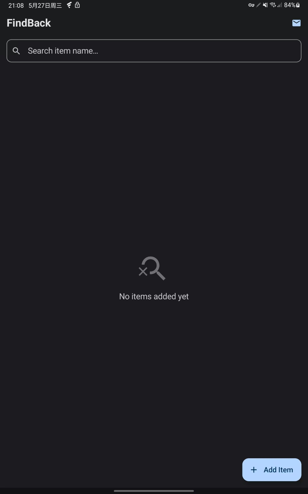
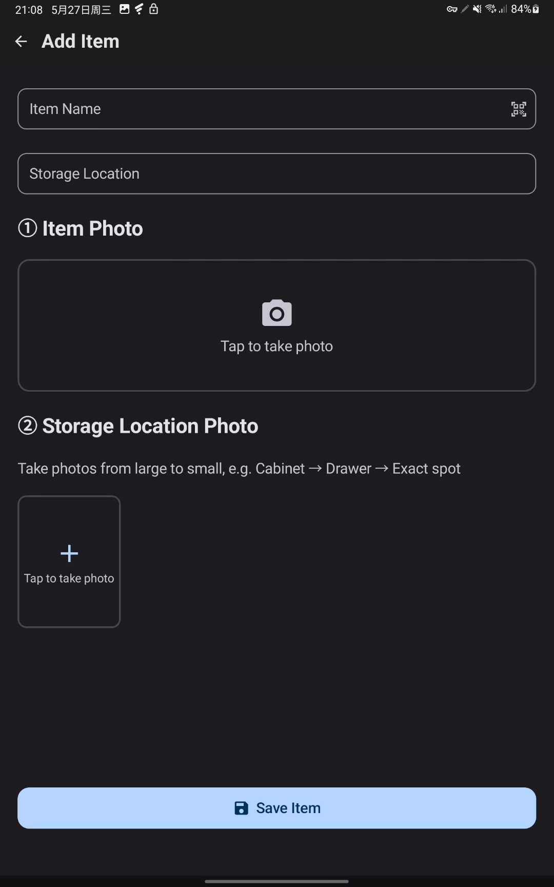

# FindBack - Never Lose Your Items Again 🔍

> I built this app to help my parents remember where they put things. My mom constantly forgets where she puts important stuff like medicine, documents, keys, chargers, etc. The idea is simple: take a photo of the item, take photos of where it's stored (room → cabinet → drawer → exact spot), and later just search the item name to find it again. I tried to make it especially easy for seniors — large buttons, minimal UI, photo-based memory instead of complicated folders/tags. Still an early version, but I'd really love feedback!

## 📸 Screenshots

| Home Screen | Item Detail |
|:-----------:|:-----------:|
|  |  |

## ✨ Features

- **📦 Item Management** — Add items with name, photo, and storage location details
- **📍 Step-by-Step Location Photos** — Take multiple location photos from large to small (e.g., Cabinet → Drawer → Exact spot) so you can retrace your steps to find anything
- **📷 Barcode Scanning** — Scan product barcodes to auto-fill item names
- **🔍 Smart Search** — Quickly find items by searching their names
- **🖼️ Full-Screen Image Viewer** — Tap any photo to view it in full screen
- **👴 Senior-Friendly Design** — Large buttons, minimal UI, photo-based navigation
- **📧 Contact Support** — Built-in contact feature to reach the developer directly

## 🚀 How It Works

1. **Add an item** — Enter the item name, take a photo of it, and add a storage location
2. **Document the location** — Take multiple location photos zooming in from wide to close-up (e.g., which room → which cabinet → which shelf)
3. **Find it later** — Search for your item by name and follow the step-by-step location photos to find it in seconds

## 🛠️ Tech Stack

- **Language:** Kotlin
- **UI Framework:** Jetpack Compose + Material Design 3
- **Architecture:** MVVM
- **Database:** Room (SQLite)
- **Image Loading:** Coil
- **Camera:** CameraX + ML Kit Barcode Scanning

## 📋 Requirements

- Android 7.0 (API 24) or higher
- Camera permission (for taking photos and scanning barcodes)

## 🏗️ Building

1. Clone the repository:
   ```bash
   git clone https://github.com/phexi/FindBack.git
   ```
2. Open the project in Android Studio
3. Sync Gradle and build

## 📧 Contact

- **Email:** iguogx@gmail.com

---

Made with ❤️ for anyone who's ever asked "Where did I put that?"
